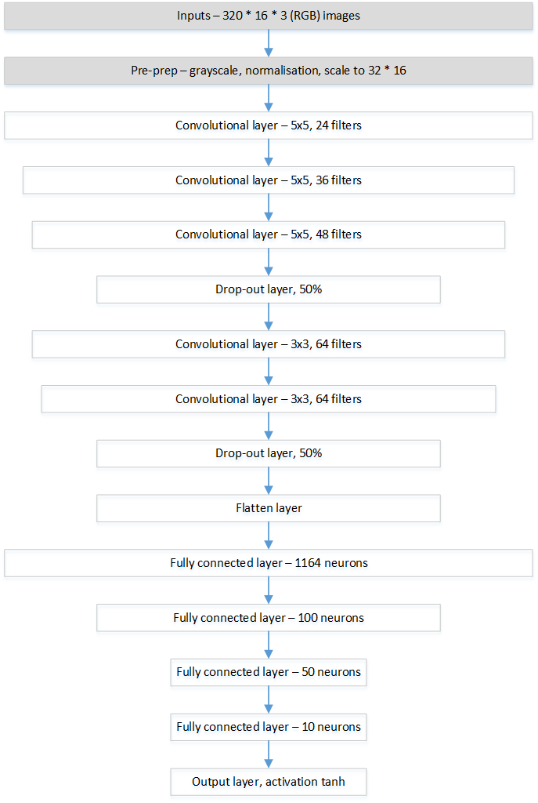

# Behavioural Cloning Project

Additional data files here: https://drive.google.com/open?id=0B2aeNxAHccrqYjEyYTIwMHYzdzQ

##Introduction
The objective of this project is to create a neural network model which can predict steering angles from front-facing car video frames, in order to navigate a car around a simulated track.  

##Approach
The approach taken was to create a model using a convolutional neural network (CNN) which will be trained using captured image and steering angle data.  The model can then be used to predict steering angles using real-time camera images.

The **drive.py** program is provided to handle I/O with the simulation software, whilst the model building programs were created during the project.

##Executing driving
The **drive.py** program takes parameters for the model source and throttle setting.

E.g. to launch with the provided model (in the 'save' folder) and expected throttle setting of 0.1, the following command line would be used:

**python drive.py save/model.json 0.1**

##Executing model building
The **model.py** program allows a variety of parameters (files to import, batch size, paths), but can be run using default options to create the chosen model:

**python model.py**

Note: although several model variants have been tested, including alternatives with filtering of input data for extreme steering angles, the **model.py** program creates only the chosen solution and does not implement the discarded models.

##Training data
Training data was available from two sources:

1. Udacity-provided data
2. New data created from the training mode in the simulation software

The Udacity-provided data contained c. 24,000 images.  Noting that only 1/3 of these are centre-frame images (which will be used for training), this gives c.8000 samples.

New data was created by driving the car in training mode.  To provide reasonably smooth driving, a Logitech Force3D analogy joystick was used - when driving the car with the keyboard it was not possible to create smooth inputs to the system.

New data was created for both driving in the center of the track - i.e. "correct" driving - and also for recovering from either side of the track. This "recovery" data was created by repeatedly driving off centre to one side and correcting back to the centre line.  The purpose of the recovery data is to train the model in how to re-centre after drifting away from the centre line - without these additional examples, the model would not know how to react when the car has drifted from the centre (which is inevitable at some point).

Note: the image capture process in the simulator provides left and right camera frames.  It would possible to use these images as additional input data.  However, this would require an offset to be calculated (to use the left/right frames as if actually recorded by the centre camera).  Because additional data could be simply created, only centre frames were used.  In real-world practice, left/right images could be used in place of recovery data, as in the real-world it will not be possible (dangerous to other road users!) to create recovery data by weaving across the road...

90% of data was used for training and 10% for validation. No test data was retained, as the behaviour of the car in the simulation was considered to be the most useful test of the model.

###Filtering the recovery data
The intention with the off-centre driving (recovery data) was to provide data which would teach the model to recover from those positions.  Because the recording of these recovery data points requires the car to actually be driven to the edge of the circuit - i.e. "incorrect" driving - and this would potentially provide bad examples, recovery data was generated for each side (left of centre, right of centre) independently.  This allows the bad examples to be filtered out of the training data (i.e. when adding recovery data for the LHS of the track, filter out samples with left/negative steering angles as those are the data points generated when getting into position prior to the recovery correction - vice versa for RHS recovery).  This filtering was implemented in the **model.py** code, at the stage of importing training data.

##Models
Three alternative models were trialled:
###1. A simple model comprising the following:
Layer1 = convolutional layer, 32 output filters, 3x3 kernal, same border mode, relu activation
Layer2 = convolutional layer, 64 output filters, 3x3 kernal, same border mode, relu activation
Layer3 = dropout layer, 50% drop-out rate
Layer4 = flatten layer
Layer5 = fully connected layer, 1024 outputs, relu activation
Layer6 = fully connected layer, 512 outputs, relu activation
Layer7 = fully connected layer, 128 outputs, relu activation
Layer8 = fully connected layer, 64 outputs, relu activation
Layer9 = fully connected layer, 1 output (final), tanh activation

###2. A more complex network comprising the following:
Layer1 = convolutional layer, 32 output filters, 3x3 kernal, same border mode, relu activation
Layer2 = convolutional layer, 64 output filters, 3x3 kernal, same border mode, relu activation
Layer3 = dropout layer, 50% drop-out rate
Layer4 = convolutional layer, 128 output filters, 3x3 kernal, same border mode, relu activation
Layer5 = convolutional layer, 256 output filters, 3x3 kernal, same border mode, relu activation
Layer6 = dropout layer, 50% drop-out rate
Layer7 = flatten layer
Layer8 = fully connected layer, 1024 outputs, relu activation
Layer9 = fully connected layer, 512 outputs, relu activation
Layer10 = fully connected layer, 128 outputs, relu activation
Layer11 = fully connected layer, 1 output (final), tanh activation

###3. An NVIDIA-style network comprising the following:
Layer1 = convolutional layer, 24 output filters, 5x5 kernal, same border mode, relu activation
Layer2 = convolutional layer, 36 output filters, 5x5 kernal, same border mode, relu activation
Layer3 = convolutional layer, 48 output filters, 5x5 kernal, same border mode, relu activation
Layer4 = dropout layer, 50% drop-out rate
Layer5 = convolutional layer, 64 output filters, 3x3 kernal, same border mode, relu activation
Layer6 = convolutional layer, 64 output filters, 3x3 kernal, same border mode, relu activation
Layer7 = dropout layer, 50% drop-out rate
Layer8 = flatten layer
Layer9 = fully connected layer, 1164 outputs, relu activation
Layer10 = fully connected layer, 100 outputs, relu activation
Layer11 = fully connected layer, 50 outputs, relu activation
Layer12 = fully connected layer, 10 outputs, relu activation
Layer10 = fully connected layer, 1 output (final), tanh activation

The NVIDIA-style model is derived from the presentation at: 
https://images.nvidia.com/content/tegra/automotive/images/2016/solutions/pdf/end-to-end-dl-using-px.pdf

The convolutional and fully connected layers are similar to those in the NVIDIA model, but with the addition of two drop-out layers to avoid over-fitting of the model to the training data.

The network is shown in the diagram below:

###Input images/pre-processing
Images were captured at 320*160 resolution and RGB.  

In a pre-processing stage the images were converted to grayscale and reduced in size to 32*16.  This size is quite small, but was required to reduce the overall number of parameters to fit into memory on the training hardware (whilst the use of a generator function avoids the need to load all images into memory, the large number of model parameters - especially in model #2 - required the input images to be relatively small).

Therefore the input shape for all models was 32*16*1.

###Generator function
As the models require many (tens of thousands) of images, a generator function was created to load only a random sample of images for a given mini-batch during network training.  This generator (and the pre-processing functions) is implemented in the **shared.py** module.

This generator function was used for all 3 models.

###Final layer activation function
The final layer activation function was chosen as **tanh**, as a continuous output value is required (the task being a regression problem rather than a discrete classification problem).

The choice of **tanh** is to give a smooth function which approximates zero at the origin.  For more details see: https://en.wikipedia.org/wiki/Activation_function 

Conveniently, **tanh** activation is built in to Keras, https://keras.io/activations/#available-activations 

All 3 models used tanh activation.

##Model choice (NVIDIA)
A comparative test of these 3 models showed that the NVIDIA-style model performed better than the other two arrangements on similar training data.  Therefore this model was chosen for refinement.

The final model was built with a training set of c.29,000 sample data points.  Of these, approx. 2,000 were recovery samples from left/right deviations from the norm (each) and the remaining 25,000 were centre-line driving examples.  This data included both the Udacity-provided data and newly generated examples.

###Model parameters
The Adam optimiser was used, which does not require much in the way of parameter tuning (https://keras.io/optimizers/#adam).  The learning rate was reduced from the common default of 0.001 to 0.0001, although in practice this did not materially change the performance of the model.

Training was conducted over 5 epochs.  It was noted that the loss and validation accuracy did not change when additional epochs were used (e.g. when testing at 10 epochs the validation accuracy result did not improve).

##Results/model evaluation
The resulting model successfully drives the car around the test circuit at a relatively low speed (throttle=0.1 or around 11mph equivalent speed).  This is a fairly poor speed, but the model keeps the car mostly at the centre line of the track and behaves consistently over multiple laps.

Using the model at higher speeds (e.g. throttle=0.2 or around 24mph equivalent speed) shows that the model tends to get into a mode of oscillations - as the car drifts to one side, the steering angle over-compensates and throws the car over the center line to the other side of the track.  The model will complete a circuit of the track at this speed - although it wouldn't be a great driving experience for the passengers - but isn't sufficiently consistent to complete multiple laps (tends to end up in a watery outcome).  

##Attempts to refine the model
The chosen model was built using some 29,000 data points. However, additional data points were created and used for training with a training data set of >40,000 data points.  Unexpectedly, this did not improve the performance of the model and in some instances caused the model performance to become worse. 

This was thought to be due to the introduction of overly aggressive recovery data steering angles and the training code was then modified to filter out data points with steering angles over a certain threshold.  This was tested at a range of steering value absolute values (0.25, 0.5, 0.55, 0.6, 0.65, 0.7, 0.75, 0.9), but did not provide any improvement in model performance.  

At low thresholds the filtering of data points was too aggressive - leading to a model in which the car tended to drive straight on at tight corners (especially at the left-hand turn with no barrier).
At high thresolds, the filtering of data points was insufficiently aggressive - leading to a model with a tendency to weave. 
 
The best threshold appeared to be c.0.65, achieving 2 laps at throttle=0.2 (i.e. approximating the performance of the chosen model).   

(Note: this is a refinement of the submitted model, not the submitted model - the submitted model is as built on 29,000 data points and does not filter extreme steering angle data points.)

##Track #2
Track #2 requires more throttle input to achieve any progress at all (i.e. at least 0.3 to get started on the initial hill) and therefore wasn't attempted with the submission model.  The combination of gradients and sharp turns on the second track suggests that a more complex modelling process would be required to complete this track - likely one model for steering angles and another model for throttle setting, potentially including a brake also.  These models would then be used concurrently to provide steering angle and throttle/brake inputs to drive the car around this more challenging track.  

##Reflections/potential further investigations
It was notable that models with the lowest validation loss did not necessarily give the best performance on the track.  For example, a model created on >40,000 data points and with a validation loss of 0.0076 crashed within one lap at throttle=0.1, whilst the chosen model was created on 29,000 data points and had a validation loss of 0.0181, yet drives consistently at throttle=0.1.

It is possible that some properties of those additional data points are causing this unexpected behaviour, even after filtering out extreme steering angles from the recovery data.  

In addition, it was clear that the higher the speed, the less stable the model.  This was assumed to be due to the simulation running at a fixed frequency, whilst at higher speeds the car travelled further between individual instructions from the controller. This would mean that when the car is recovering to the centre line, there would be a tendency to over-shoot - which in turn would require a more extreme steering input to return the car to the centre and so cause a more extreme over-shoot.  This was considered to be the cause of the model of oscillations/fish-tailing behaviour.

# Appendix: Model Building Output
The following is output from the final model training process (Keras progress output truncated).

/home/neil/anaconda3/envs/keras/bin/python /home/neil/Documents/CarND-Behavioural-Cloning/model_nvidia_final.py
Using TensorFlow backend.
NVIDIA model

Starting data load...
17:41:26

Imported  25448  centre frames
Total frames so far : 25448
Range of label values :  -0.9426954  to  1.0

Imported  1737  left frames
Total frames so far : 27185
Range of label values :  -0.9426954  to  1.0

Imported  2092  right frames
Total frames so far : 29277
Range of label values :  -0.9999623  to  1.0

Total frames :  29277

Split training/validation sets ( 0.9 / 0.09999999999999998 )
Training set size   :  26349
Validation set size :  2928

Creating model...

Layer (type)                     Output Shape          Param #     Connected to

convolution2d_1 (Convolution2D)  (None, 32, 16, 24)    624         convolution2d_input_1[0][0]      
____________________________________________________________________________________________________
convolution2d_2 (Convolution2D)  (None, 32, 16, 36)    21636       convolution2d_1[0][0]            
____________________________________________________________________________________________________
convolution2d_3 (Convolution2D)  (None, 32, 16, 48)    43248       convolution2d_2[0][0]            
____________________________________________________________________________________________________
dropout_1 (Dropout)              (None, 32, 16, 48)    0           convolution2d_3[0][0]            
____________________________________________________________________________________________________
convolution2d_4 (Convolution2D)  (None, 32, 16, 64)    27712       dropout_1[0][0]                  
____________________________________________________________________________________________________
convolution2d_5 (Convolution2D)  (None, 32, 16, 64)    36928       convolution2d_4[0][0]            
____________________________________________________________________________________________________
dropout_2 (Dropout)              (None, 32, 16, 64)    0           convolution2d_5[0][0]            
____________________________________________________________________________________________________
flatten_1 (Flatten)              (None, 32768)         0           dropout_2[0][0]                  
____________________________________________________________________________________________________
dense_1 (Dense)                  (None, 1164)          38143116    flatten_1[0][0]                  
____________________________________________________________________________________________________
dense_2 (Dense)                  (None, 100)           116500      dense_1[0][0]                    
____________________________________________________________________________________________________
dense_3 (Dense)                  (None, 50)            5050        dense_2[0][0]                    
____________________________________________________________________________________________________
dense_4 (Dense)                  (None, 10)            510         dense_3[0][0]                    

output (Dense)                   (None, 1)             11          dense_4[0][0]                    

Total params: 38,395,335
Trainable params: 38,395,335
Non-trainable params: 0
____________________________________________________________________________________________________
Model created

Epoch 1/5
26368/26349 [] - 395s - loss: 0.0363 - val_loss: 0.0230
Epoch 2/5
26368/26349 [] - 357s - loss: 0.0233 - val_loss: 0.0214
Epoch 3/5
26368/26349 [] - 359s - loss: 0.0206 - val_loss: 0.0193
Epoch 4/5
26368/26349 [] - 368s - loss: 0.0195 - val_loss: 0.0181
Epoch 5/5
 26368/26349 [] - 371s - loss: 0.0189 - val_loss: 0.0181

Training time :  30.891084162394204  minutes

Process finished with exit code 0
